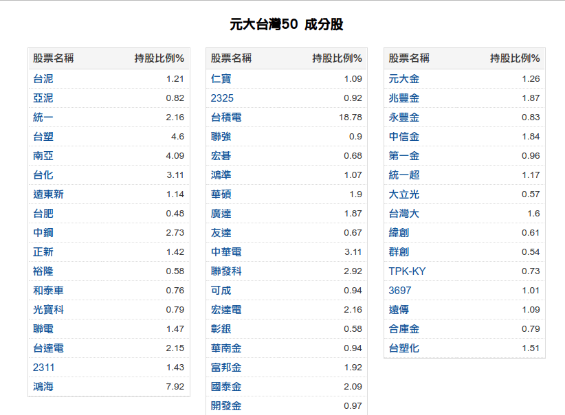
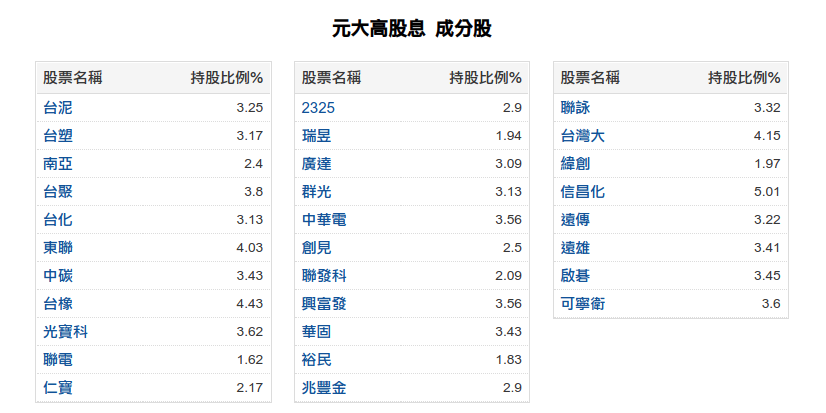
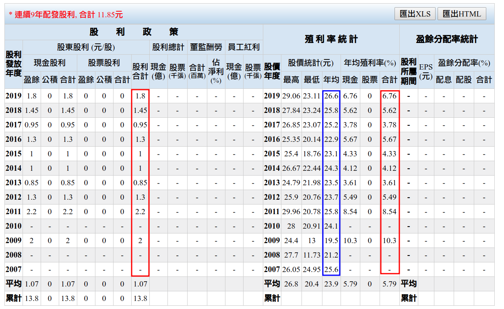
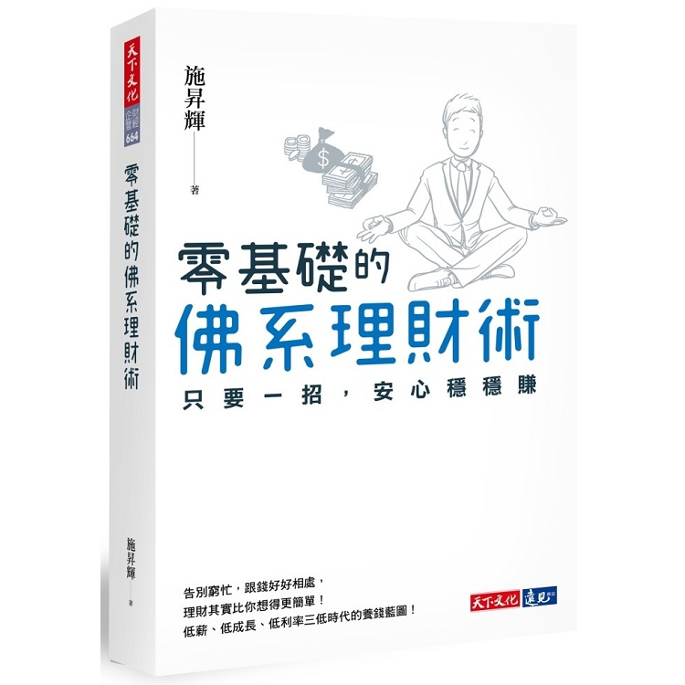
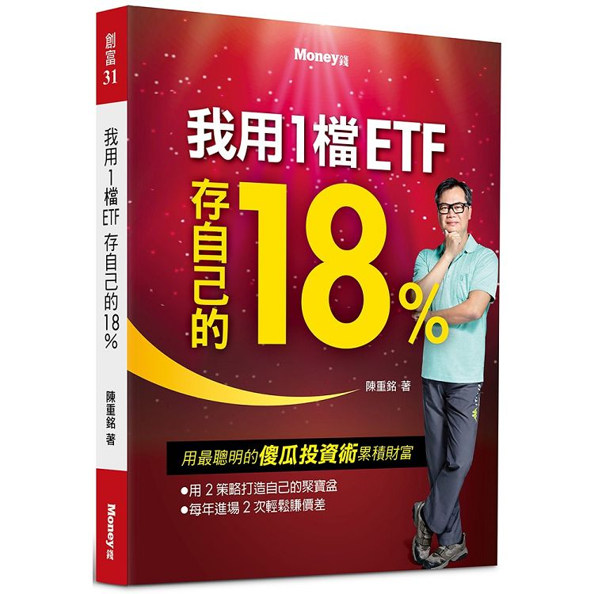

# ETF

- 買ETF 好處`不會倒` 可以安心買
- 只要專注買便宜 `->` 耐心等到目標價獲利了結

`唯一能打敗大盤的只有大盤`，所以買ETF就能安穩的貼著大盤指數往前行進，其主要目的是為了避免個股的漲跌所帶來的影響，被動而為也正好是佛系的重點原則，因此你可以這麼做：

- 無腦的買法，傻傻的買0050或0056，買完請忘記
- 進階的買法，台股萬點以下買 0050，可以賺價差，台股萬點以上買0056，
- 固定配息，不會下市，即使套牢也不須太擔心。

## 0050 vs 0056

- 0050 較具優勢汰弱追強讓 0050 持續具有成長力
    - 市值前50大公司 
    - 因為淨值會成長，整體報酬率高過 0056。 
    - 0050 的特點是穩定，長期投資還可以賺進股價的成長，但是股息就不太迷人了
    

- 0056 標榜高股息 穩定有餘、成長力稍不足
    - 從台灣50和中型100成分股中，挑選出30檔標的根據據預測/估計一年現金股利殖利率，由高到低排名選出前30的股票，並用殖利率決定權重 
    - 0056 的特點就是  每年穩定配發約 1 元的現金股利 

## 0056 特性
- 0056 的股價都在 20∼25 元區間震盪
- 每年穩定配發約 1 元的現金股利

https://goodinfo.tw/StockInfo/StockDividendPolicy.asp?STOCK_ID=0056

## 用 0056 做價差策略穩穩賺
### 操作 23 元以下買進

平時慢慢存錢，當股價跌到 23 元時，

採用逢低加碼的`三角形買法`，

舉例來說，假設手上有 50 萬元資金，

當股價跌到 23 元時買進 10% 的資金，

跌到 22 元時再買進 20%⋯⋯

如果落實三角形買進策略，

這 50 萬元總共會買進 23.86 張，

每股的成本只有 21 元。

### 當股價不漲時，就安心領取每年 1 元的現金股利， 也有 4.77%  的報酬率但是當股價漲到 25 元附近時可以考慮賣出

參考:  
https://www.cmoney.tw/notes/note-detail.aspx?nid=85923

### 補充
- 不要追高買，大跌大買 小跌小買 (相當三角形買法)
- 買在五年均價以下 or 最好是五年低價平均價
- 資產配置 
    - https://www.stockfeel.com.tw/%e5%82%b5%e5%88%b8%e8%88%87%e8%b3%87%e7%94%a2%e9%85%8d%e7%bd%ae/

根據 Reserve Bank of Australia 的分析，以美國國債和 S&P500 為例，過去一百年間，股市不好時，就會降息刺激經濟，債券就會漲，因此，股市和債市的確走相反方向。但自1,999年後，`股市和債市的走向，大多正相關`，近10年更是如此。這已經是資產管理顧問，很頭痛的問題了。

為何如此？有一說，因為世界上錢越來越多，買家太多，就算升息，債券也跌的不多，破壞了原本與股市的關係。詳細原因，就留給專家去研究。我們只須知道，債券跟股市的波動，已經走相同方向。

在投資組合中加入債券的主張，提出「股債平衡」的策略，認為可提高報酬率。聽起來，的確很迷人。讓我用另一個角度，來談「股債平衡」。

`「利用『低買高賣』的策略，將手上資產配置 50%『現金』、50% 股市，等股市漲一倍後，賣出 25%，改持『現金』，等股市跌 50% 之後，在將『現金』拿去買股票，反覆操作，迅速致富。」`

你相信這個說法嗎？如果，你不信這樣的方法，`為何把「現金」改成「債券」，這個理論就成立？`

我對債券本身並無意見，但對「再平衡」是有疑慮的，因為「再平衡」跟 Timing 市場有何不同？而且難度更高。因為，原本只要猜股市，現在連債市也要猜。
 
 

## ETF書單

- 零基礎的佛系理財術：只要一招，安心穩穩賺 by 施昇輝
    -  https://www.books.com.tw/products/0010814872

- 我用1檔ETF存自己的18% by 陳重銘 
    -  https://www.books.com.tw/products/0010824151

