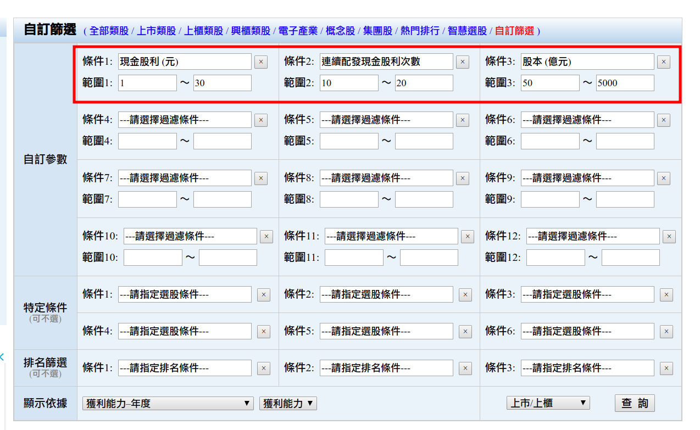

# 投資策略


##投資行為

###一. 有三件事情主宰了ㄧ般投資人的行為
1. 恐懼
2. 貪婪
3. 市場波動


- `為什麼股價上升很慢，下跌卻很快？`
    - 從心理學層面來講，這是由於恐懼比貪婪更有爆發力！


六次重要的金融危機：

1.證交稅實施    2.中共試射飛彈  3.亞洲金融風暴

4.網路泡沫化    5.SARS疫情       6.次級房貸


https://kknews.cc/finance/l2ez2x9.html


**市場波動時可能就是賺錢的機會來了，漲高做空，跌深反彈時做多**

###二. 克服恐懼有三個方法	
1. 減少恐懼發生的機會
2. 了解你投資的標的物
3. 不在同ㄧ類標的物投入太高的部位

###三. 克服貪婪有二個方法
1. 永遠不要賺最後ㄧ塊錢
2. 有的錢不是你該賺的

---

## 好股票、買便宜、 耐心等
- 好股票
    - 長期獲利、擁有護城河、具獨占性 etc..
    - 元大0056、元大0050
    - 台灣50
    - 中型100
- 買便宜(危機入世 ex: 股災)
    - 本益比
    - 歷史價格
    - 殖利率
- 耐心等
    - 長期持有(成本很低收股利不賣) 
    - 股利 + 價差(本小)  
    
###補充
- 統計會投資失敗主因是心裡層面問題(投資最大敵人貪跟怕)
- 只要買股票就會帳面上虧損 (需要耐心信心愛心持股)
- 永遠不知道絕對低高點，只有相對高低
- 股票會漲會跌是買賣而來
- 任何產業都有景氣好壞問題，只是長短不一

---

## 篩選股票
- 連續10年以上發現金股利
- 現金股利至少1元以上
- 股本大於50億




```
https://goodinfo.tw/StockInfo/StockList.asp?MARKET_CAT=%E8%87%AA%E8%A8%82%E7%AF%A9%E9%81%B8&INDUSTRY_CAT=%E6%88%91%E7%9A%84%E6%A2%9D%E4%BB%B6&FILTER_ITEM0=%E7%8F%BE%E9%87%91%E8%82%A1%E5%88%A9+%28%E5%85%83%29&FILTER_VAL_S0=1&FILTER_VAL_E0=30&FILTER_ITEM1=%E9%80%A3%E7%BA%8C%E9%85%8D%E7%99%BC%E7%8F%BE%E9%87%91%E8%82%A1%E5%88%A9%E6%AC%A1%E6%95%B8&FILTER_VAL_S1=10&FILTER_VAL_E1=20&FILTER_ITEM2=%E8%82%A1%E6%9C%AC+%28%E5%84%84%E5%85%83%29&FILTER_VAL_S2=50&FILTER_VAL_E2=5000&FILTER_ITEM3=---%E8%AB%8B%E9%81%B8%E6%93%87%E9%81%8E%E6%BF%BE%E6%A2%9D%E4%BB%B6---&FILTER_VAL_S3=&FILTER_VAL_E3=&FILTER_ITEM4=---%E8%AB%8B%E9%81%B8%E6%93%87%E9%81%8E%E6%BF%BE%E6%A2%9D%E4%BB%B6---&FILTER_VAL_S4=&FILTER_VAL_E4=&FILTER_ITEM5=---%E8%AB%8B%E9%81%B8%E6%93%87%E9%81%8E%E6%BF%BE%E6%A2%9D%E4%BB%B6---&FILTER_VAL_S5=&FILTER_VAL_E5=&FILTER_ITEM6=---%E8%AB%8B%E9%81%B8%E6%93%87%E9%81%8E%E6%BF%BE%E6%A2%9D%E4%BB%B6---&FILTER_VAL_S6=&FILTER_VAL_E6=&FILTER_ITEM7=---%E8%AB%8B%E9%81%B8%E6%93%87%E9%81%8E%E6%BF%BE%E6%A2%9D%E4%BB%B6---&FILTER_VAL_S7=&FILTER_VAL_E7=&FILTER_ITEM8=---%E8%AB%8B%E9%81%B8%E6%93%87%E9%81%8E%E6%BF%BE%E6%A2%9D%E4%BB%B6---&FILTER_VAL_S8=&FILTER_VAL_E8=&FILTER_ITEM9=---%E8%AB%8B%E9%81%B8%E6%93%87%E9%81%8E%E6%BF%BE%E6%A2%9D%E4%BB%B6---&FILTER_VAL_S9=&FILTER_VAL_E9=&FILTER_ITEM10=---%E8%AB%8B%E9%81%B8%E6%93%87%E9%81%8E%E6%BF%BE%E6%A2%9D%E4%BB%B6---&FILTER_VAL_S10=&FILTER_VAL_E10=&FILTER_ITEM11=---%E8%AB%8B%E9%81%B8%E6%93%87%E9%81%8E%E6%BF%BE%E6%A2%9D%E4%BB%B6---&FILTER_VAL_S11=&FILTER_VAL_E11=&FILTER_RULE0=---%E8%AB%8B%E6%8C%87%E5%AE%9A%E9%81%B8%E8%82%A1%E6%A2%9D%E4%BB%B6---&FILTER_RULE1=---%E8%AB%8B%E6%8C%87%E5%AE%9A%E9%81%B8%E8%82%A1%E6%A2%9D%E4%BB%B6---&FILTER_RULE2=---%E8%AB%8B%E6%8C%87%E5%AE%9A%E9%81%B8%E8%82%A1%E6%A2%9D%E4%BB%B6---&FILTER_RULE3=---%E8%AB%8B%E6%8C%87%E5%AE%9A%E9%81%B8%E8%82%A1%E6%A2%9D%E4%BB%B6---&FILTER_RULE4=---%E8%AB%8B%E6%8C%87%E5%AE%9A%E9%81%B8%E8%82%A1%E6%A2%9D%E4%BB%B6---&FILTER_RULE5=---%E8%AB%8B%E6%8C%87%E5%AE%9A%E9%81%B8%E8%82%A1%E6%A2%9D%E4%BB%B6---&FILTER_RANK0=---%E8%AB%8B%E6%8C%87%E5%AE%9A%E6%8E%92%E5%90%8D%E6%A2%9D%E4%BB%B6---&FILTER_RANK1=---%E8%AB%8B%E6%8C%87%E5%AE%9A%E6%8E%92%E5%90%8D%E6%A2%9D%E4%BB%B6---&FILTER_RANK2=---%E8%AB%8B%E6%8C%87%E5%AE%9A%E6%8E%92%E5%90%8D%E6%A2%9D%E4%BB%B6---&FILTER_SHEET=%E5%B9%B4%E7%8D%B2%E5%88%A9%E8%83%BD%E5%8A%9B&FILTER_SHEET2=%E7%8D%B2%E5%88%A9%E8%83%BD%E5%8A%9B&FILTER_MARKET=%E4%B8%8A%E5%B8%82%2F%E4%B8%8A%E6%AB%83&FILTER_QUERY=%E6%9F%A5++%E8%A9%A2
```

---

## 書單

###練選股<br>
◎ 財報狗教你挖好股穩賺20% 財報狗著<br>
◎ 雷浩斯教你小薪水存好股又賺波段 雷浩斯著<br>
◎ 不買飆股，年均獲利40％<br>

###練買、賣股<br>
◎ 存好股，我穩穩賺 溫國信著<br>
◎ 小資女艾蜜莉：我的資產翻倍存股筆記<br>

###練抱股<br>
◎ 用心於不交易 林茂昌著<br>
◎ 投資最重要的事：一本股神巴菲特讀了兩遍的書<br>


###財報<br>
◎ 人人都能學會看懂財報(全圖解)<br>
◎ 用生活常識就能看懂財務報表 林明樟著<br>
◎ 會計學新論 林蕙真著<br>

###ETF<br>
◎ 我用1檔ETF存自己的18% 陳重銘著<br>
◎ 零基礎的佛系理財術 施昇輝著<br>


###國外經典書籍<br>
◎ 永恆的價值─巴菲特傳<br>
◎ 安全邊際(Margin of Safety)<br>
◎ 智慧型股票投資人<br>
◎ 非常潛力股<br>
◎ 巴菲特寫給股東的信<br>
◎ 財務報表分析(馬丁佛萊德森版本)<br>
◎ 窮查理日誌<br>
◎ 一個投機者的告白系列三書b<r>